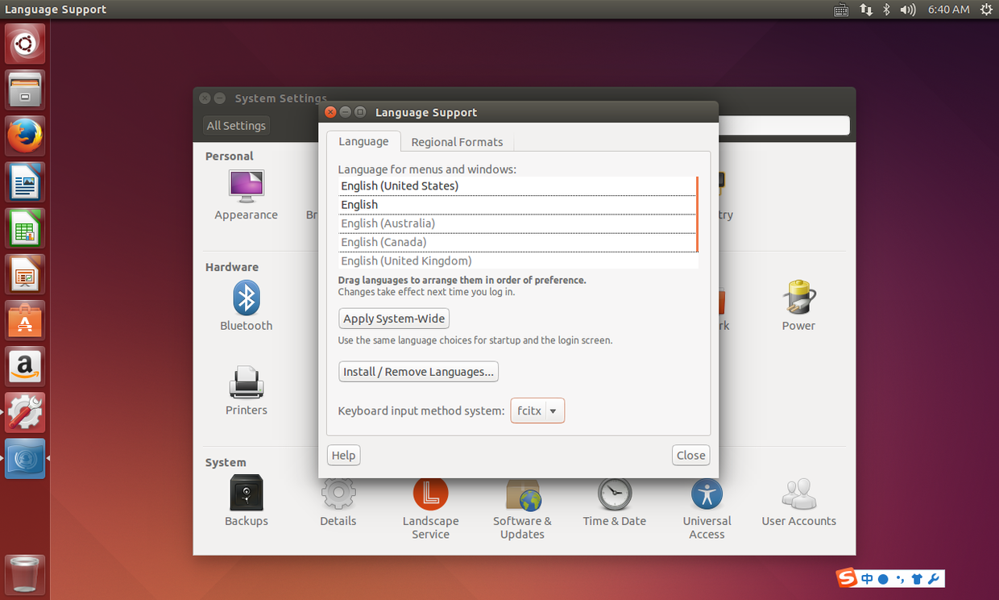
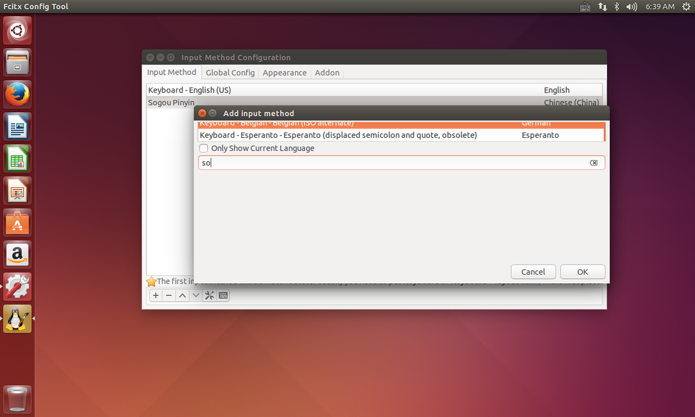

# 如何在 ubuntu 下安装搜狗输入法

日期：2015-09-27 22:47

网址：<http://www.jianshu.com/p/a0c64adaedd4>

---

在 linux 下要打中文要借助 fcitx 的帮助。

下面是我在第一次使用 ubuntu 并安装搜狗输入法的过程及遇到的一些问题和解决方法。

1.  首先在搜狗官网上下载 sogou for linux。
    

2.  打开下好的文件，在 ubuntu 14 中会直接进入应用商城并完成安装。

3.  打开设置 进入 "language support"，在 "keyborad input" 中选择 "fcitx"。  
    

4.  重启后可以发现最右上面有了小企鹅的图标 ，点击选择配置。
    
    点加号，取消那个勾。在搜索中寻找 "sogou pingyin" 点 "ok"，然后就可以
    使用了。

在后来帮同学安装的过程中遇到了一些问题，最多的是 fcitx 的版本不够导致不能安装。

在搜狗的官网上用应用商店安装 update 极慢 ，基本不动，所以我又去寻找安装 fcitx 的方法。

<http://blog.csdn.net/sprintfwater/article/details/8866169>

这是我找的解决方法。

用终端完成，代码:

> ```
> sudo add-apt-repository ppa:fcitx-team/stable
> 然后
> sudo apt-get update
> 更新完成后
> sudo dpkg -i fcitx-sogoupinyin_0.0.0-2_i386.deb
> 安装配置工具 
> sudo apt-get install fcitx-config-gtk
> 打开语言支持，换为 fcitx，注销
> fcitx-config-gtk3
> ```

完成。
